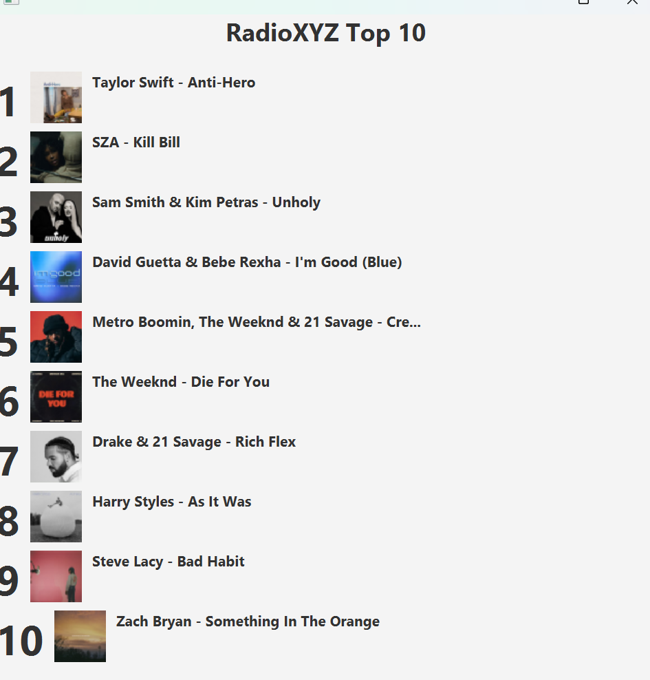

# Taller01-Ramas

HEAD

## Rama: titulo (Líder)

  

## Cambio de Orden del TOP - Integrante 2: Nicole Guevara

Se modifico el orden para mostrar el Top 10, ahora esta en forma descendente (10 a 1)

  

## Rama: artista (integrante 3)

  

 832013a (- Se modificó el código para que el nombre del artista aparezca antes del título de la canción.)
